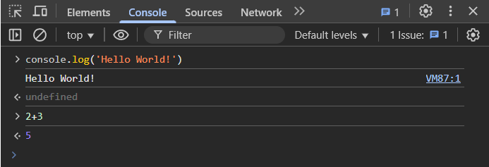
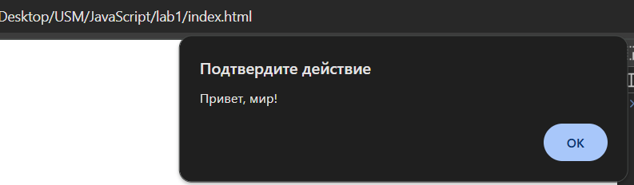
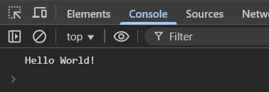
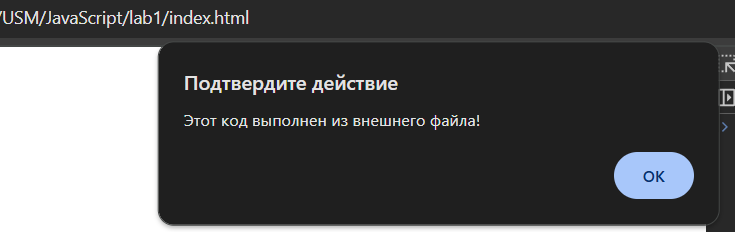
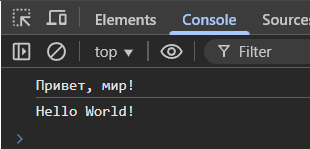
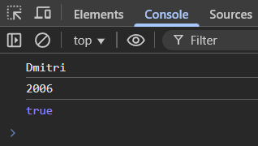
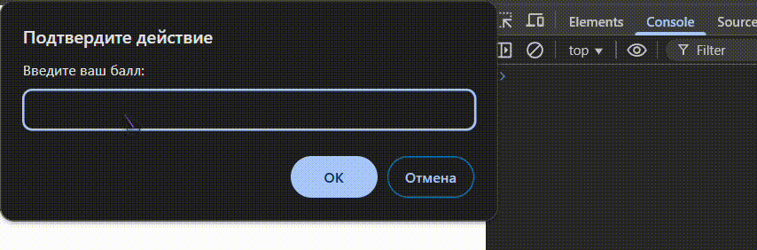

# Лабораторная работа №1
## Цель работы
Познакомиться с основами JavaScript, научиться писать и выполнять код в браузере и в локальной среде, разобраться с базовыми конструкциями языка.

# Условие

## **Задание 1. Выполнение кода в браузере.**

### 1. Открываю консоль разработчика в брузере Google Chorme, нажав (F12) и выбираю вкладку "*Console*", после чего написав в консоли команду `console.log('Hello World!')`. После этой команды я ввёл сумму двух чисел, что выдало мне результат, как показано на рисунке.



### 2. Создав файл `index.html`, я написал следующий код:
```html
<!DOCTYPE html>
<html lang="en">
<head>
    <meta charset="UTF-8">
    <title>Lab1PlotnicDmitri</title>
</head>
<body>
    <script>
        alert("Привет, мир!");
        console.log("Hello World!");
    </script>
</body>
</html>
```
- #### После чего, открываю файл `index.html`.
    
    

### 3. Подключение внешнего файла
1. Создаю файл `script.js`.
- Ввожу следующие команды:
    ```javascript
    alert("Этот код выполнен из внешнего файла!");
    console.log("Привет, мир!");
    ```
- Подключаю файл `script.js` в код `HTML` командой:
   ```html
   <script src="script.js"></script>
   ```
- Открываю страницу в браузере
    
    

## Задание 2. Работа с типами данных
1. Объявление переменных и работа с типами данных.

   - В файле `script.js` создаю несколько переменных:

     - `name`
     - `birthYear` 
     - `isStudent` 

   - Вывожу их на консоль.
    ```javascript
    let name = 'Dmitri'
    let yearBirth = '2006'
    let isStudent = true
    console.log(name)
    console.log(yearBirth)
    console.log(isStudent)
    ```
    

2. Управление потоком выполнения (условия и циклы)
- Вставляю код в файл `script.js`
    ```javascript
   let score = prompt("Введите ваш балл:");
   if (score >= 90) {
     console.log("Отлично!");
   } else if (score >= 70) {
     console.log("Хорошо");
   } else {
     console.log("Можно лучше!");
   }

   for (let i = 1; i <= 5; i++) {
     console.log(`Итерация: ${i}`);
   }
   ```
    Итерация происходит 5 раз, так как выставлены парметры цикла `for`.

    

___
### Контрольные вопросы
1. Чем отличается `var` от `let` и `const`?
    - `var` имеет функциональную область видимости, можно переопределять.
    - `let` имеет блочную область видимости, можно изменять, но нельзя объявлять повторно.
    - `const` тоже блочный, но его значение менять нельзя.
2. Что такое неявное преобразование типов в JavaScript?
    - Неявное преобразование типов – это когда JavaScript автоматически меняет тип данных, чтобы выполнить операцию.
3. Как работает оператор `==` в сравнении с `===`?
    - `==` (Нестрогое равенство): преобразует значения в один и тот же тип данных перед сравнением (приведение типов). Проверяет, равны ли два значения. Если значения равны, результатом будет true , иначе — false.
    - `===` === (Строгое равенство): сравнивает как значение, так и тип данных без преобразования типов. Другими словами, если a и b имеют разные типы, то проверка a === b немедленно возвращает false без попытки их преобразования


## Вывод
В ходе лабораторной работы, я научился:
- Выполнять код в браузере.
- Выполнять код в файле `index.html`, записав его в `<script></script>`.
- Работать с типами данных.
- Выполнять циклы.
- Заполнять README файл.

## Библиография
- [Источник 1](https://learn.javascript.ru/comparison#:~:text=Оператор%20строгого%20равенства%20%3D%3D%3D%20проверяет,false%20без%20попытки%20их%20преобразования.)

- [Источник 2](https://sky.pro/wiki/html/operatory-sravneniya-kak-i-kogda-ispolzovat/)

- [Youtube источник](https://www.youtube.com/watch?v=ZV8fNtV1mOM&t=327s)
